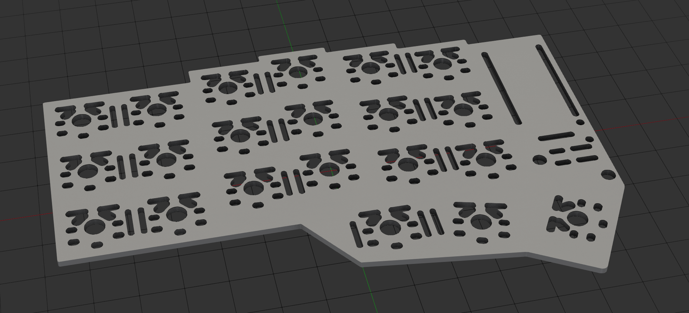

### Bottom plate for corne lite keyboard that allows maximum thinness by only hiding legs of components

### TODOs
- [ ] add SVG for cutting from acrylic
- [ ] add clips that fit into holes on PCB to 3D model
